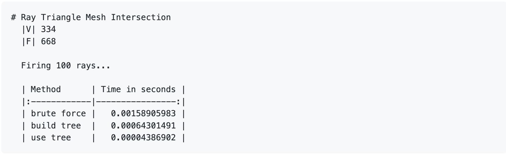
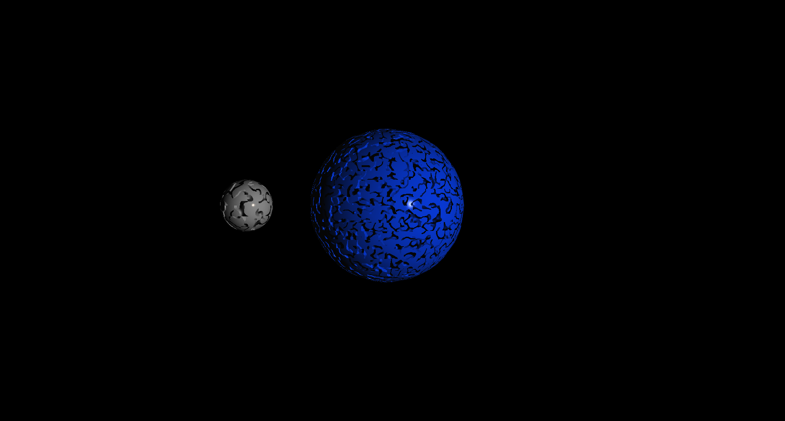
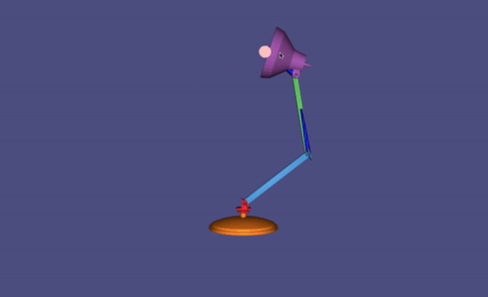

# **CSC317**

## **Computer Graphics**

**Note**: These are the assignments that I completed in this course. That means the skeleton of the project was given to us by the instructor and I worked on completing the required tasks.
In this course, I worked on computer graphics concepts like modeling, rendering, and animation. Specifically the assignments involved Raster Images, Ray Casting, Ray Tracing, Bounding Volume Hierarchy, Meshes, Transformation, Projection and Shading, Kinematics, and Mass Spring Systems.
The following are the assignments of this course in detail.

### **`Assignment 1`**

In this assignment, we represented the image files by the basic uncompressed format [*ppm*](https://en.wikipedia.org/wiki/Netpbm_format#File_format_description). 

We represented the image files in RGB and RGBA formats and implemented the following tasks on them:

- Apply reflection and rotation on images.
- Convert RGB image to grayscale image.
- Simulating the **Bayer mosaic**, by taking a 3-channel rgb image and creating a single channel grayscale image composed of interleaved red/green/blue channels. We mosaiced the image into a grayscale this way.
- Turn the mosaicized image (using Bayers filter) to a colour image, i.e. Demosaicize the image. To demosaicize, we need to take an average of all 8 neighbouring cellscreate a 3-channel rgb image.
- Convert a RGB image represented by red, green and blue intensities to its representation using hue, saturation and value.
- Convert a color represented by hue, saturation and value to its RGB representation using red, green and blue intensities.
- Shift the hue of a color RGB image.
- Desaturate a given RGB color image by a given factor.
- Compute C = A Over B, where A and B are semi-transparent rgba images and "Over" is the **Porter-Duff**'s Over operator.

    <kbd></kbd>

    <kbd></kbd>

The pictures are from the assignment's handout which you can view [*here*](assignments/A1/A1.pdf).

 

---

### **`Assignment 2`**

In this assignment, we used spheres, planes, and triangles as the primitives for 3D geometry, to compute the intersection of them with a ray of light (i.e. ray casting). We implemented the following tasks:

- Construct a viewing ray given a camera and subscripts to a pixel.
- Find the first (visible) hit given a ray and a collection of scene objects.
- Intersect a sphere with a ray.
- Intersect a plane with a ray.
- Intersect a triangle with a ray.
- Intersect a triangle soup with a ray.

    <kbd></kbd>

The picture is from the lecture slides of this course and you can view the assignment handout [*here*](assignments/A2/A2.pdf).

 

---

### **`Assignment 3`**

In this assignment, we implemented a render so that we can render objects with global illumination effects using a recursive ray tracing.
We implemented the following tasks:

- Compute the direction to a point light source and its parametric distance from a query point.
- Compute the direction to a direction light source and its parametric distance from a query point (infinity).
- Make use of `first_hit.cpp` to shoot a ray into the scene, collect hit information and use this to return a color value.
- Compute the lit color of a hit object in the scene using [*Blinn-Phong shading model*](https://en.wikipedia.org/wiki/Blinn%E2%80%93Phong_shading_model). This function should also shoot an additional ray to each light source to check for shadows.
- Given an "incoming" vector and a normal vector, compute the mirror reflected "outgoing" vector.
- Be creative! Design a scene using any of the available Object types (spheres, planes, triangles, triangle soups), Light types (directional, point), Material parameters, colors (materials and/or lights), and don't forget about the camera parameters.

    <kbd></kbd>

The pictures are from the assignment's handout which you can view [*here*](assignments/A3/A3.pdf).

 

---

### **`Assignment 4`**

In this assignment, we used Bounding Volume Hierarchy structures (like AABB trees) to optimize the ray intersection searches.

    <kbd></kbd>

We implemented the following tasks:

**Optimizing ray intersection with a triangle mesh using AABB trees**

- Shoot a ray at a triangle mesh with n faces and record the closest hit. Use a brute force loop over all triangles, aim for O(n) complexity but focus on correctness. 
- Construct an axis-aligned bounding box (AABB) tree given a list of objects. Use the midpoint along the longest axis of the box containing the given objects to determine the left-right split.
- Determine whether and how a ray intersects the contents of an AABB tree. The method should perform in O(log n) time for a tree containing n (reasonably distributed) objects. We compared this method with the bruteforce and saw a much faster results when using the AABB tree:

    <kbd></kbd>

**Optimizing min distance computation of a query point from a set of points using AABB trees**

- Compute the nearest neighbor of a query point in the set of n points (rows of points). This should be a slow reference implementation. Aim for a computational complexity of O(n) but focus on correctness.
- Compute the distrance from a query point to the objects stored in a AABBTree using a priority queue. 
We compared this method with the bruteforce and saw a much faster results when using the AABB tree:

    <kbd></kbd>

**Optimizing object-object intersection using AABB trees**

- Determine whether two triangles intersect.
- Determine if two bounding boxes intersect.
- Find all intersecting pairs of leaf boxes between the AABB tree of one object and AABB tree of another object.

    <kbd></kbd>

The pictures are from the assignment's handout which you can view [*here*](assignments/A4/A4.pdf).

 

---

### **`Assignment 5`**

In this assignment we implemented the following tasks:

- Create meshes of a cube and a sphere by storing their 3-D vertices, texture mapping parameterization, and per-face normals in seperate arrays. We then applied a texture map on them.

    <kbd></kbd>

    <kbd></kbd>

- Compute per-face normals, per-vertex normals, and per-corner normals for a triangle mesh.

    <kbd></kbd>

- Conduct `num_iters` iterations of [*Catmull-Clark subdivision*](https://en.wikipedia.org/wiki/Catmull%E2%80%93Clark_subdivision_surface) on a pure quad mesh (V,F).

    <kbd></kbd>

The pictures are from the assignment's handout which you can view [*here*](assignments/A5/A5.pdf).

 

---

### **`Assignment 6`**

In this assignment we used rendering piplines and the [*OpenGL shading language (glsl)*](https://en.wikipedia.org/wiki/OpenGL_Shading_Language) to create interesting pictures. Specifically we tried to simulate an animation of a moon orbiting around a planet by rotations, and adding textures, lights, and colours.

    <kbd></kbd>

You can view the assignment's handout [*here*](assignments/A6/A6.pdf).

 

---

### **`Assignment 7`**

In this assignment we used the Kinematics to animate shapes rigged to an internal skeleton and we implemented the following tasks:

-- Use **Forward Kinematics** to transform the skeleton's bones to take a specified configuration by transforming them by a specified angles.

    <kbd></kbd>

-- Use **Inverse Kinematics** to find the optimal angles to transform the skeleton's bones to, such that the resultant configuration locates the end-effector bones at the 3-D goal locations.

    <kbd></kbd>

The pictures are from the assignment's handout which you can view [*here*](assignments/A7/A7.pdf).

 

---

### **`Assignment 8`**

In this assignment we used Mass-Spring Systems to animate a deformable shape. We model the shape's physical behavior by treating it as a network of point masses and springs. We considered our shape as a graph where each vertex is a point mass and each edge is a spring. Then we computed the displacement of the springs as the result of the forces exerted on them by compression and decompressin, through time. 

    <kbd></kbd>

 

    <kbd></kbd>

The pictures are from the assignment's handout which you can view [*here*](assignments/A8/A8.pdf).
